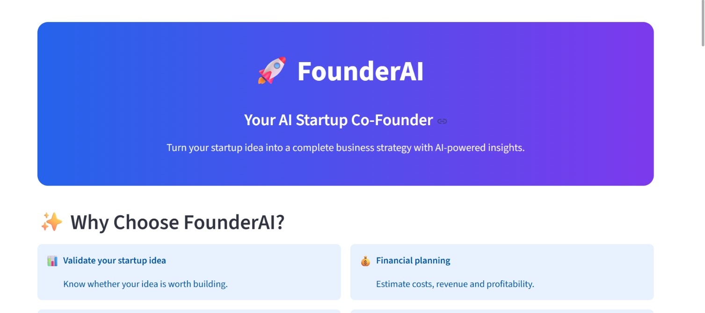
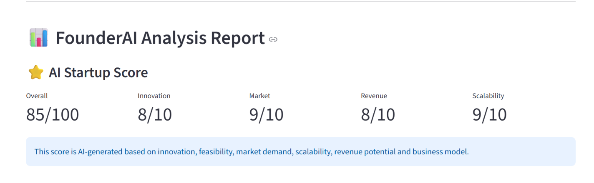
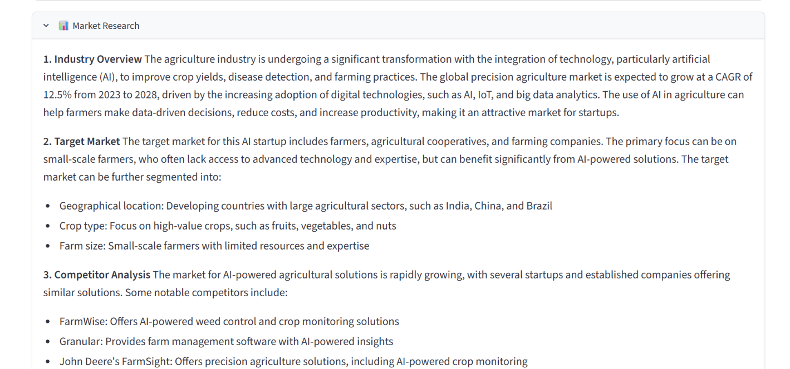
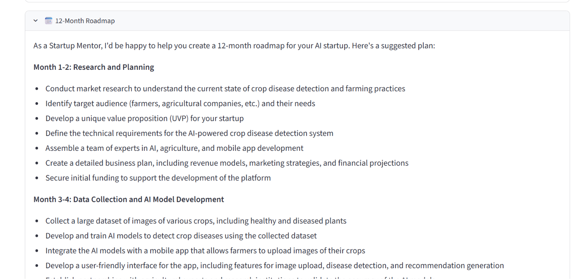

# 🚀 FounderAI – AI Startup Co-Founder

<p align="center">

Transform your startup idea into a complete business strategy using AI-powered multi-agent intelligence.

Built with **Python**, **Streamlit**, **LangChain**, and **Groq LLM**.

</p>

---

## 📖 Overview

FounderAI is an **Agentic AI platform** that acts as your virtual startup co-founder.

Instead of providing a single AI response, FounderAI coordinates multiple AI agents to evaluate a startup idea from different business perspectives including validation, market research, competitor analysis, financial planning, marketing, and execution strategy.

Whether you're an entrepreneur, student, or innovator, FounderAI helps convert raw ideas into actionable business plans within minutes.

---

# ✨ Key Features

- ✅ AI Startup Score
- ✅ Startup Idea Validation
- ✅ Market Research
- ✅ Competitor Analysis
- ✅ Business Model Generation
- ✅ Financial Planning
- ✅ Marketing Strategy
- ✅ Investor Pitch
- ✅ 12-Month Execution Roadmap
- ✅ Multi-Agent AI Workflow
- ✅ Download Complete Startup Report

---

# 📸 Application Preview

## 🏠 Home Page

<p align="center">

</p>

---

## ⭐ AI Startup Score

<p align="center">

</p>

---

## 📊 Business Analysis Report

<p align="center">

</p>

---

## 🗓️ Roadmap & Investor Report

<p align="center">

</p>

---

# 🧠 AI Agents

FounderAI consists of multiple specialized AI agents working together.

| AI Agent | Responsibility |
|----------|----------------|
| 💡 Idea Validator | Validates startup feasibility |
| 📊 Market Research Agent | Analyzes market demand and opportunities |
| ⚔️ Competitor Agent | Identifies competitors and market gaps |
| 🏢 Business Model Agent | Creates a complete business model |
| 💰 Financial Planner | Estimates investment, revenue and profitability |
| 📢 Marketing Agent | Generates customer acquisition strategies |
| 🎤 Investor Pitch Agent | Creates an investor-ready pitch |
| ⭐ Startup Score Agent | Calculates startup potential |
| 🗓️ Roadmap Agent | Generates a 12-month execution plan |

---

# ⚙️ Tech Stack

### Programming

- Python

### Framework

- Streamlit

### LLM

- Groq
- LangChain

### Libraries

- python-dotenv
- Markdown
- Regex

---

# 📂 Project Structure

```text
FounderAI
│
├── agents/
│   ├── business_model.py
│   ├── competitor_analysis.py
│   ├── financial_planner.py
│   ├── idea_validator.py
│   ├── investor_pitch.py
│   ├── marketing_strategy.py
│   ├── market_research.py
│   ├── roadmap.py
│   └── startup_score.py
│
├── screenshots/
│
├── app.py
├── requirements.txt
├── README.md
└── .env
```

---

# 🚀 Installation

### Clone Repository

```bash
git clone https://github.com/muskanbodthewar/FounderAI.git
```

Move into the project folder

```bash
cd FounderAI
```

Install dependencies

```bash
pip install -r requirements.txt
```

Create a `.env` file

```env
GROQ_API_KEY=YOUR_GROQ_API_KEY
```

Run the application

```bash
streamlit run app.py
```

---

# 🔄 Workflow

```text
               Startup Idea
                     │
                     ▼
          AI Startup Score Agent
                     │
                     ▼
          Idea Validation Agent
                     │
                     ▼
        Market Research Agent
                     │
                     ▼
      Competitor Analysis Agent
                     │
                     ▼
        Business Model Agent
                     │
                     ▼
      Financial Planning Agent
                     │
                     ▼
      Marketing Strategy Agent
                     │
                     ▼
         Investor Pitch Agent
                     │
                     ▼
      12-Month Roadmap Agent
                     │
                     ▼
       Download Business Report
```

---

# 🎯 Use Cases

FounderAI can be used by

- Startup Founders
- Entrepreneurs
- Students
- Incubators
- Investors
- Business Consultants
- Innovation Labs
- Hackathon Participants

---

# 🔮 Future Improvements

- PDF Report Generation
- PowerPoint Pitch Deck Generator
- SWOT Analysis
- Risk Assessment
- Team Recommendation Agent
- Funding Estimation
- Startup Logo Generator
- Market Size Visualization
- Business Canvas Export
- Multi-language Support

---

# 👩‍💻 Author

## Muskan Bodthewar

**Aspiring Data Scientist | Machine Learning | Deep Learning | Generative AI | Agentic AI**

### GitHub

https://github.com/muskanbodthewar

### LinkedIn

https://www.linkedin.com/in/muskanbodthewar

---

# ⭐ Support

If you found this project useful,

please consider giving it a ⭐ on GitHub.

It motivates me to build more AI projects.

---

<p align="center">

Made with ❤️ using Python, Streamlit & Agentic AI

</p>
